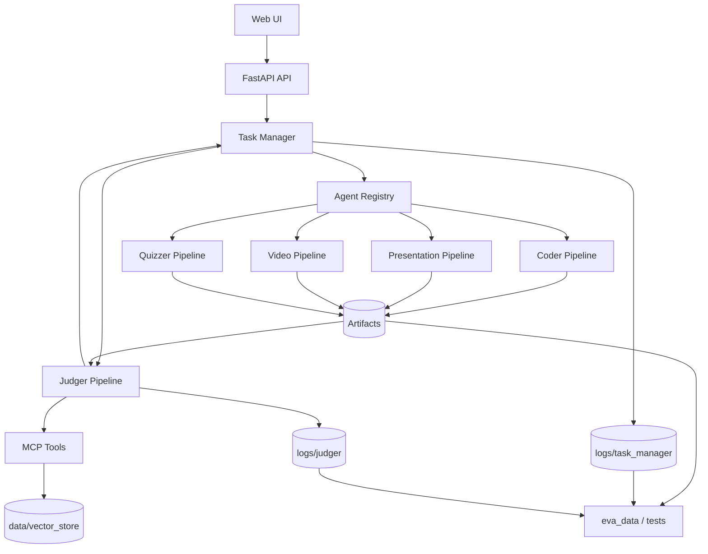

# AI-Pedia: A Multi-Agent System for Educational Content Generation and Validation

This Project is a multi-agent educational content generation system designed as an engineering pipeline rather than a single-shot demo. It combines dependency-aware orchestration, specialized generation agents, streaming observability, judging/validation loops, deployment support, and packaged evaluation assets.

Given a topic and optional uploaded sources, the system can generate coordinated learning artifacts, including:

- runnable Python code
- presentation slides (PPTX)
- narrated lesson videos (MP4)
- structured quizzes

The system is intended to improve coordination, validation support, and traceability across multiple educational artifacts generated from the same topic.

## Table of Contents

- [Project Purpose and Contribution](#project-purpose-and-contribution)
- [Reviewer Entry Points](#reviewer-entry-points)
- [Quick Start for Reviewer](#quick-start-for-reviewer)
- [Core Capabilities](#core-capabilities)
- [System Architecture](#system-architecture)
- [Repository Structure](#repository-structure)
- [Execution Flow and Contribution Logic](#execution-flow-and-contribution-logic)
- [Agent Responsibilities](#agent-responsibilities)
- [API Endpoints](#api-endpoints)
- [Streaming Event Protocol](#streaming-event-protocol)
- [Configuration and Evaluation Inputs](#configuration-and-evaluation-inputs)
- [Installation](#installation)
- [Run the System](#run-the-system)
- [Docker and Deployment](#docker-and-deployment)
- [Testing, Validation, and Observability](#testing-validation-and-observability)
- [Evaluation and Results](#evaluation-and-results)
- [Output and Logs](#output-and-logs)
- [Current Scope and Known Limitations](#current-scope-and-known-limitations)
- [Common Runtime Issues](#common-runtime-issues)
- [License](#license)

## Project Purpose and Contribution

Single-agent prompting is often insufficient for coordinated multi-artifact educational generation, especially when slides, code, quizzes, and videos need to remain aligned to the same topic. AI-Pedia addresses this by combining dependency-aware orchestration, specialized generation pipelines, judging/validation loops, and observable execution traces.

The project contribution is therefore not only artifact generation, but also workflow control, validation support, and evaluation packaging for inspection and grading.

## Reviewer Entry Points

If you are reviewing this project for grading, start with the following files and directories:

- [README.md](README.md): project overview, architecture, reproduction guidance, and review map
- [SYSTEM_FULL_DOCUMENTATION.txt](SYSTEM_FULL_DOCUMENTATION.txt): extended system-level documentation
- [ALIYUN_PRODUCTION_RUNBOOK.txt](ALIYUN_PRODUCTION_RUNBOOK.txt): deployment-oriented runbook
- `manager_agent/`, `judger_agent/`, `moe_layer/`: core orchestration and generation logic
- `tests/`: validation and workflow checking scripts
- `eva_data/`: packaged evaluation assets and consolidated result files

### Recommended Reading Order

1. Read this `README.md` for the project overview, architecture, and reproduction path.
2. Inspect `manager_agent/`, `judger_agent/`, and `moe_layer/` for the core system logic.
3. Review `tests/` for validation and workflow checks.
4. Review `eva_data/` for packaged evaluation scripts and result summaries.
5. Refer to `SYSTEM_FULL_DOCUMENTATION.txt` and `ALIYUN_PRODUCTION_RUNBOOK.txt` for system-wide and deployment-specific details.

## Quick Start for Reviewer

Minimal verified local inspection path:

1. Install dependencies.
2. Set API keys (`OPENAI_API_KEY`, and either `OPENROUTER_API_KEY` or `CODER_API_KEY`).
3. Run `python demo_front_end.py`.
4. Open `http://localhost:8000`.
5. Upload a source file if desired, select outputs, and click `Generate`.
6. Observe SSE progress events in the UI.
7. Inspect generated artifacts and trace logs.

Recommended reviewer checks after generation:

- confirm that SSE events are streamed in the UI
- inspect generated artifacts under `data/generated_code/` and `data/slides/`
- inspect `logs/task_manager/` and `logs/judger/` for trace records

## Core Capabilities

- dependency-aware multi-agent orchestration through a Task Manager and Agent Registry
- streaming-first user experience via SSE (`plan`, `step_start`, `artifact`, `video_progress`, etc.)
- hybrid rule-based and semantic judging with retry/fix-instruction loops
- source-aware generation with upload registry and optional vector indexing
- structured presentation generation from storyboard JSON
- end-to-end video composition from slides, narration, and FFmpeg-based assembly
- structured quiz generation with normalization and validation support
- persistent artifacts and run logs for traceability and diagnostics

## System Architecture



Architecture layers:

1. **Web/API layer**: request handling, streaming, artifact serving
2. **Orchestration layer**: planning, dependency handling, retries, refine flow
3. **Specialized generation layer**: coder, presentation, video, and quiz pipelines
4. **Validation layer**: hybrid rule-based and semantic acceptance checks
5. **Tooling/data layer**: MCP tools, vector store, logs, and generated artifacts
6. **Evaluation and evidence layer**: packaged evaluation assets, tests, and configs

## Repository Structure

Current repository layout:

```text
AI_Pedia_Local_stream/
  ai_pedia_mcp_server/                  # MCP server and tools (e.g., python check, RAG)
  configs/                              # experiment/evaluation configuration
  data/
    assets/                             # template assets (e.g., PPT template resources)
    generated_code/                     # runtime generated outputs
    slides/                             # generated slide outputs
    uploads/                            # uploaded user sources
    vector_store/                       # local retrieval persistence
  eva_data/                             # primary maintained evaluation package
  judger_agent/                         # judging and validation logic
  logs/
    judger/                             # per-run judging logs
    task_manager/                       # per-run orchestration logs
  manager_agent/                        # task manager and orchestration logic
  moe_layer/                            # specialized agent pipelines
  static/                               # frontend static assets
  templates/                            # frontend templates
  tests/                                # validation/integration/evaluation scripts
  ALIYUN_PRODUCTION_RUNBOOK.txt
  SYSTEM_FULL_DOCUMENTATION.txt
  demo_front_end.py
  config.py
  docker-compose.yml
  Dockerfile
  requirements*.txt
```

Reviewer focus:

- `manager_agent/`, `judger_agent/`, and `moe_layer/` contain the core system logic
- `tests/` contains validation and workflow checks
- `eva_data/` contains packaged evaluation evidence used for inspection
- `data/` and `logs/` contain runtime outputs and traces


## Execution Flow and Contribution Logic

1. **Request intake (`/stream_generate`)**
   - accepts topic, selected output types, and optional uploaded source references
   - contribution value: provides one unified entry point for multi-artifact generation

2. **Source handling (`/upload`, `/uploaded_sources`)**
   - stores files, tracks indexing status, and exposes source registry to the frontend
   - contribution value: supports reusable source-grounded generation across follow-up tasks

3. **Plan and dependency graph**
   - the Task Manager normalizes tasks and dependency order, for example ensuring that video follows slide generation
   - contribution value: is designed to reduce cross-artifact mismatch and invalid execution order

4. **Agent execution and streaming visibility**
   - executes specialized pipelines while emitting live stage and status events
   - contribution value: supports workflow transparency and easier debugging during long runs

5. **Judging and retry loop**
   - applies rule-based and semantic criteria, then injects fix instructions on failure where applicable
   - contribution value: is intended to improve reliability beyond unvalidated raw model generation

6. **Artifact finalization and logging**
   - persists artifacts under run directories and records orchestration and judging traces
   - contribution value: supports traceability, postmortem analysis, and grading evidence

## Agent Responsibilities

- **Task Manager** (`manager_agent/task_manager_agent.py`)
  - central orchestrator for planning, dependency handling, retries, and refine flow
  - primary/default pipeline component

- **Coder Agent** (`moe_layer/coder_agent/*`)
  - generates runnable Python code with controlled output path rules
  - validated by Python checking toolchain
  - primary/default pipeline component

- **Presentation Agent** (`moe_layer/presentation_agent/*`)
  - creates storyboard JSON and builds PPTX outputs
  - primary/default pipeline component

- **Video Agent** (`moe_layer/video_agent/*`)
  - converts slides, generates narration scripts, and composes final MP4 outputs
  - optional/heavier pipeline component; depends on slide generation and system video dependencies

- **Quizzer Agent** (`moe_layer/quizzer_agent/*`)
  - produces normalized structured quiz outputs with validation and retry support
  - primary/default pipeline component

- **Text Agent** (`moe_layer/text_generator_agent/*`)
  - currently placeholder/non-primary in the default workflow

## API Endpoints

Defined in `demo_front_end.py`:

- `GET /`
  - main web interface

- `POST /upload`
  - upload one or more source files

- `GET /uploaded_sources`
  - list uploaded source status and metadata for source reuse

- `GET /stream_generate`
  - start the main generation stream (SSE)

- `GET /refine_stream`
  - refine an existing artifact or task output (SSE)

- `GET /artifact_file?path=...`
  - serve artifacts inline or as attachments

- `GET /presentation_preview?path=...`
  - generate or return slide preview images for PPTX files

Note: generation and refinement streams are exposed as `GET` endpoints because they are implemented as SSE-based streaming responses rather than standard non-streaming request/response form submissions.

## Streaming Event Protocol

Main workflow SSE events:

- `plan`: exposes initial workflow planning decisions
- `step_start`: marks the start of an artifact-specific stage
- `log`: streams intermediate execution information
- `artifact`: reports newly generated outputs
- `video_progress`: reports long-running video generation progress
- `quiz`: streams quiz-specific output events
- `step_complete`: marks completion of a pipeline stage
- `workflow_complete`: marks completion of the coordinated run
- `error`: surfaces failure state to the UI

Refine workflow SSE events:

- `log`
- `artifact`
- `complete`
- `error`

Event purpose:

- user transparency for long-running tasks
- fine-grained observability during runtime
- easier inspection during demonstrations and grading

## Configuration and Evaluation Inputs

### Runtime Configuration

Key paths in `config.py` include:

- `DATA_DIR`
- `GENERATED_DIR`
- `SLIDES_DIR`
- `ASSETS_DIR`
- `UPLOADS_DIR`
- `LOGS_DIR`
- `TEMPLATE_PATH`

Environment variables include:

- `OPENAI_API_KEY`
- `OPENROUTER_API_KEY` or `CODER_API_KEY`
- `CODER_MODEL` (default: `qwen/qwen3-coder-flash`)
- `CODER_BASE_URL` (default: `https://openrouter.ai/api/v1`)
- `TASK_MANAGER_MODEL` (default: `gpt-5.2`)
- `JUDGER_MODEL` (default: `gpt-5.2`)
- `TASK_PLAN_MAX_RETRIES` (default: `3`)
- `TASK_MAX_RETRIES` (default: `3`)
- `DEV_MODE`

### Evaluation Inputs

- `configs/eval_topics.json`: evaluation topic configuration
- `eva_data/`: packaged evaluation scripts, datasets, and result summaries

Runtime configuration controls execution behavior, while `configs/` and `eva_data/` provide evaluation-side inputs and evidence packaging.

## Installation

### Required for Core System

- Python 3.11+
- FFmpeg
- LibreOffice (required for PPTX preview and video pipeline conversion: PPTX -> PDF -> images)

### Optional for Extended Capabilities

- Tesseract OCR runtime (for image OCR ingestion)
- RAG extras (`requirements-rag.txt`)

Install:

```bash
python -m venv .venv

# Windows PowerShell
.venv\Scripts\Activate.ps1

# Linux/macOS
source .venv/bin/activate

pip install -r requirements.txt

# optional
pip install -r requirements-rag.txt
```

## Run the System

Set the required keys first, then run:

```bash
# Windows PowerShell
$env:OPENAI_API_KEY="your_openai_key"
$env:OPENROUTER_API_KEY="your_openrouter_key"
python demo_front_end.py
```

Open `http://localhost:8000`.

The simplest verified path for local inspection is `python demo_front_end.py`, which serves the web UI on port `8000`.

Alternative server launch:

```bash
uvicorn demo_front_end:app --host 0.0.0.0 --port 8000
```

## Docker and Deployment

### Local Docker Compose

```bash
docker compose up -d --build ai-pedia
docker compose logs -f --tail=200 ai-pedia
```

### Cloud and Production Notes

- deployment runbook: [ALIYUN_PRODUCTION_RUNBOOK.txt](ALIYUN_PRODUCTION_RUNBOOK.txt)
- the compose service uses `restart: unless-stopped` in `docker-compose.yml`
- recommended for server-side operation with SSH-based monitoring

The repository includes both container-based local deployment support and a server-oriented runbook for Aliyun-based deployment, but local execution remains the simplest inspection path for grading.

## Testing, Validation, and Observability

### Test Suite (`tests/`)

Representative validation coverage includes:

- artifact reference checks (`test_artifact_refs.py`)
- judging logic and failure-handling checks (`test_judger_logic_fix.py`)
- semantic acceptance criteria checks (`test_judger_semantic_criteria.py`)
- dependency blocking checks for workflow correctness (`test_workflow_dependency_blocking.py`)
- presentation pipeline integration checks (`test_presentation_integration.py`)
- evaluation execution and learning-gain related scripts (`evaluation_runner.py`, `learning_gain_evaluator.py`)

### Validation Mechanisms

- rule-based criteria checks such as `output_shape`, `file_exists`, and `mcp_tool`
- semantic judging for content-level acceptance criteria
- dependency blocking safeguards to avoid invalid downstream execution

### Observability

- `logs/task_manager/*.json`: run plans, per-task status, and final run status
- `logs/judger/*.json`: criteria-by-criteria judging records
- `ai_pedia_mcp_server/logs/python_check_errors.jsonl`: Python check failures
- SSE event streaming in the UI for runtime transparency

## Evaluation and Results

The primary maintained evaluation package is `eva_data/`.

Key files and directories include:

- `eva_data/README.md`
- `eva_data/evaluation_release/code/eval_student_lessons.py`
- `eva_data/evaluation_release/code/eval_student_lessons_tinyllama_summary.py`
- `eva_data/compute_results_metrics.py`
- `eva_data/computed_results_metrics.json`
- `eva_data/computed_results_metrics.md`
- `eva_data/evaluation_release/results/`
- `eva_data/student_lessons/`

Interpretation:

- `evaluation_release/code/` contains packaged evaluation scripts
- `evaluation_release/results/` contains structured model/topic evaluation outputs
- `computed_results_metrics.*` contains consolidated metric summaries

Recommended reviewer path:

1. Read `eva_data/README.md` for evaluation package context.
2. Inspect `eva_data/computed_results_metrics.md` for the most compact summary of consolidated results.
3. Inspect `eva_data/evaluation_release/results/` for structured per-topic or per-run outputs.
4. Inspect `eva_data/evaluation_release/code/` if script-level evaluation logic needs to be checked.

This evaluation package is intended to provide inspectable evidence of system behavior and result organization, rather than serving as a benchmark-claim section inside the README itself.

## Output and Logs

### Runtime Outputs

- `data/generated_code/run_<run_id>/...`: scripts, assets, output artifacts, and related run files
- `data/slides/`: generated slide files
- `data/uploads/`: uploaded source files and source registry data
- `data/vector_store/`: local retrieval index persistence

### Runtime Logs

- `logs/task_manager/`: orchestration traces
- `logs/judger/`: judging traces

Packaged evaluation outputs are documented separately in the [Evaluation and Results](#evaluation-and-results) section above.

## Current Scope and Known Limitations

- `Text Agent` is currently placeholder and is not part of the default primary workflow.
- Optional dependencies such as RAG, OCR, and video tooling affect specific module capabilities.
- Large uploaded documents can substantially increase latency in full pipelines.
- Some semantic validation behavior remains model-assisted rather than purely rule-complete.
- End-to-end latency and artifact completeness can vary depending on selected output types, document size, and external tool/model availability.

## Common Runtime Issues

This section is included mainly to support local inspection or deployment reproduction.

### 1) Missing API keys

**Symptoms:** model calls fail early.

**Fix:** set `OPENAI_API_KEY` and either `OPENROUTER_API_KEY` or `CODER_API_KEY`.

### 2) Video generation failures

**Symptoms:** no MP4 output, conversion errors, or composition failures.

**Fix:** verify FFmpeg and LibreOffice availability on `PATH` (LibreOffice is required for PPTX-to-PDF conversion in preview/video flow).

### 3) RAG unavailable

**Symptoms:** indexing or search warnings, such as missing `chromadb`.

**Fix:** install `requirements-rag.txt`; the system can fall back to text-only mode.

### 4) No OCR text from images

**Symptoms:** image uploads produce empty extracted text.

**Fix:** install Tesseract runtime and related Python packages.

### 5) Refine stream interruption symptoms

**Symptoms:** refine stream appears to disconnect during long tasks.

**Fix:** inspect server or container logs and ensure continuous SSE/log heartbeat behavior in the deployment setup.

## License

This project is licensed under the Apache License 2.0. See [LICENSE](LICENSE) for details.
